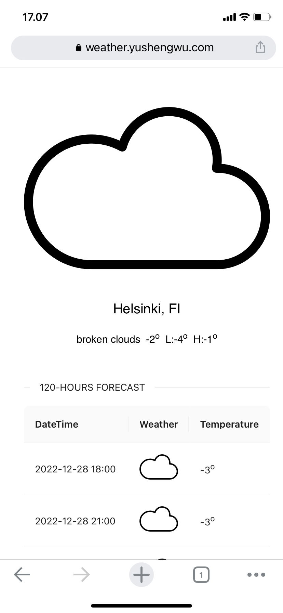

Here is a full-stack weather project showing current weather and forecasts. It's a take-home task from [eficode](https://www.eficode.com/?hsLang=en), and the requirements are [here](./docs/task.md).

Not much you can do with it, only two things:

- When your browser asks for permission to get a location, allow it, then the weather here shows based on your location. Otherwise, in most cases, accessing your location is blocked by default, then the default location (Helsinki, Finland) will be used.
- Forecasts are displayed on pages that can be chosen.
